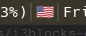

# sway-layoutflag

Displays country flag representing the current keyboard layout in [Sway WM](https://swaywm.org/).



# Requirements

Dependencies: swaymsg (typically distributed along with sway), [jq](https://github.com/stedolan/jq). Also make sure that your swaybar font supports [Unicode Emoji Flag Sequences](https://www.unicode.org/reports/tr51/#Flags) ([Hack](https://sourcefoundry.org/hack/) is a good choice).

# Block configuration

Recommended configuration:

```INI
[sway-layoutflag]
command=$SCRIPT_DIR/sway-layoutflag
flags=us,ru
interval=persist
```

`flags` - required parameter. Comma-separated list of 2-letter country codes as defined in [ISO 3166-1](https://en.wikipedia.org/wiki/ISO_3166-1_alpha-2). Make sure that this list corresponds to `xkb_layout` list in your sway input configuration. Look for something like
```
input * {
    xkb_layout us,ru
}
```
in your sway config. Keep in mind that `xkb_layout` codes are not `ISO 3166-1`. You should verify them before using in `flags`.
